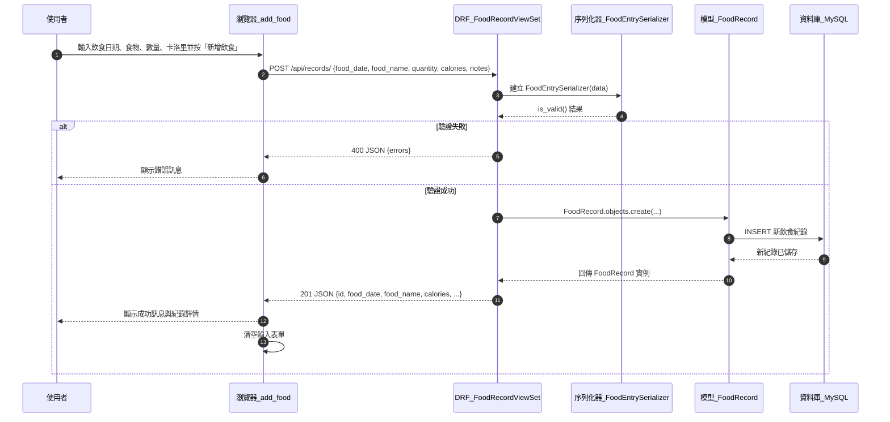
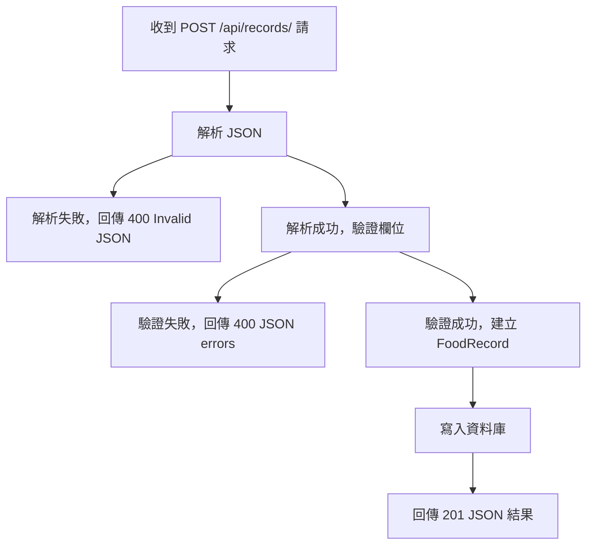

# 飲食記錄應用 V3 (Django 5 + Bootstrap 5 + DRF + MySQL)

## 專案簡介與功能

本專案是一個使用 Django 5 與 Django REST Framework 建立的飲食記錄與卡路里管理應用。V3 版本已加入 Bootstrap 5 美化、RESTful API 操作頁、MySQL 設定，以及 Docker Compose 的 app + db + nginx 多容器部署。

## V3 作業重點

- **Bootstrap 5 美化**：首頁、導覽列、登入/註冊、新增飲食、歷史查詢與 API 操作頁皆使用 Bootstrap 元件與統一版型。
- **RESTful API**：導入 DRF ViewSet，提供 `/api/records/` 飲食紀錄 CRUD 與 `/api/summary/` 統計摘要 JSON。
- **API 操作網頁**：登入後可進入 `/api-tools/`，直接在網頁上測試 GET、POST、DELETE。
- **MySQL 資料庫**：Docker 環境使用 MySQL 官方映像 `mysql:8.4`。
- **Docker Compose 部署**：`docker-compose.yml` 可一鍵啟動 `app`、`db`、`nginx` 三個服務。

## Docker Compose 一鍵部署

在 GitHub clone 專案到模擬雲端部署環境後，於專案根目錄執行：

```bash
docker compose up --build
```

啟動完成後開啟：

- **網站首頁**：http://localhost:8080/
- **API 操作頁**：http://localhost:8080/api-tools/
- **DRF Browsable API**：http://localhost:8080/api/records/
- **摘要 API**：http://localhost:8080/api/summary/

首次使用請先註冊帳號，再登入操作網站與 API。

### Docker Compose 服務

| 服務 | 映像/來源 | 說明 |
|------|-----------|------|
| app | 本專案 Dockerfile | Django + Gunicorn，啟動時自動 migrate 與 collectstatic |
| db | mysql:8.4 | MySQL 官方映像，使用 utf8mb4 |
| nginx | nginx:1.27-alpine | 對外提供 8080 port，反向代理至 app |

## REST API 說明

API 需登入後使用，可透過瀏覽器 session、DRF Browsable API 或 Postman Basic Auth/Session Cookie 測試。

### 1. 飲食紀錄 CRUD：`/api/records/`

| 方法 | URL | 功能 |
|------|-----|------|
| GET | `/api/records/` | 取得目前使用者的全部飲食紀錄 |
| POST | `/api/records/` | 新增飲食紀錄 |
| GET | `/api/records/<id>/` | 取得單筆飲食紀錄 |
| PUT/PATCH | `/api/records/<id>/` | 更新單筆飲食紀錄 |
| DELETE | `/api/records/<id>/` | 刪除單筆飲食紀錄 |

POST JSON 範例：

```json
{
  "food_date": "2026-06-05",
  "food_name": "雞肉便當",
  "calories": 650,
  "quantity": "1 份",
  "notes": "午餐"
}
```

### 2. 統計摘要：`/api/summary/`

```json
{
  "record_count": 3,
  "total_calories": 1650
}
```

## Postman 測試建議

1. 先在網站註冊並登入。
2. 使用瀏覽器開發者工具複製 session cookie，或在 Postman 先對登入頁送出表單取得 cookie。
3. 測試 `GET http://localhost:8080/api/records/`，確認回傳 JSON 陣列。
4. 測試 `POST http://localhost:8080/api/records/`，Body 選 raw JSON，送出上方範例資料。
5. 測試 `GET http://localhost:8080/api/summary/`，確認統計值更新。

## 本機開發模式

若只想用原本 SQLite 快速檢查或開發，可設定 `DB_ENGINE=sqlite`：

```powershell
$env:DB_ENGINE='sqlite'
python manage.py migrate
python manage.py runserver
```

Docker Compose 預設會使用 MySQL，不需額外設定 `DB_ENGINE`。

## 功能列表

本專案提供：

### 身份認證功能
- 使用者註冊（含密碼驗證）
- 使用者登入與登出
- 基於登入的頁面保護

### 飲食記錄功能
- 線上紀錄日常飲食項目、數量與卡路里量（支援 Web 表單和 API 方式）
- 自動將每筆飲食紀錄（食物名稱、數量、卡路里、日期、備註）儲存到資料庫
- 以表格方式瀏覽飲食紀錄，按飲食日期與新增時間排序
- 刪除單筆飲食紀錄（含權限驗證）
- 對飲食紀錄列表進行分頁顯示（每頁最多 10 筆）
- 自動計算全部紀錄的總卡路里數
- 每位使用者只能檢視與管理自己的飲食紀錄

## 專案檔案結構與說明

```text
django_hw3-prj_B1204080/
├─ manage.py                     # Django 專案指令列入口
├─ db.sqlite3                    # SQLite 本機開發備用資料庫檔
├─ Dockerfile                    # Django app 容器映像設定
├─ docker-compose.yml            # app + db + nginx 多容器部署設定
├─ entrypoint.sh                 # 容器啟動時執行 migrate 與 collectstatic
├─ nginx/
│  └─ default.conf               # Nginx 反向代理設定
├─ requirements.txt              # 專案依賴套件清單
├─ config/                       # 專案設定與入口
│  ├─ __init__.py
│  ├─ settings.py                # 本專案所有設定（apps、DB、模板、靜態檔案等）
│  ├─ urls.py                    # 專案層級 URL 入口，include food_tracker.urls
│  ├─ wsgi.py                    # WSGI 入口，用於傳統伺服器部署
│  └─ asgi.py                    # ASGI 入口，用於 async/WS/WebSocket 伺服器
└─ food_tracker/                 # 飲食紀錄功能應用 (app)
   ├─ __init__.py
   ├─ models.py                  # FoodRecord 模型：儲存單次飲食紀錄資料
   ├─ serializers.py             # FoodEntrySerializer：驗證飲食輸入資料
   ├─ urls.py                    # app 層級 URL：身份認證、新增頁、查詢頁、API 等
   ├─ views.py                   # Web view 與 API view（認證、新增飲食、分頁、刪除紀錄）
   ├─ forms.py                   # 使用者註冊與飲食紀錄表單
   ├─ admin.py                   # Django 後台管理配置
   ├─ migrations/                # Django 自動產生的資料庫遷移檔
   └─ templates/                 # HTML 模板
      ├─ base.html               # 共用版型（導覽列、Bootstrap、全站字體）
      ├─ home.html               # 首頁
      ├─ register.html           # 使用者註冊頁面
      ├─ login.html              # 使用者登入頁面
      ├─ add_food.html           # 新增飲食頁面（含前端 fetch 邏輯）
      └─ history.html            # 查詢飲食紀錄（表格 + 分頁 + 卡路里統計）
```

## 開發環境與執行指令

### 1. 建立 / 啟用 Python 環境

建議使用虛擬環境（venv、conda 等），以下以 conda 為例：

```bash
# 使用 conda 啟用環境
conda activate <環境名稱>

# 或使用 venv
python -m venv .venv
# Windows
.venv\Scripts\activate
```

### 2. 安裝相依套件

本專案已在 `requirements.txt` 列出主要依賴（Django、Django REST Framework 等），在新環境中只需要執行：

```bash
pip install -r requirements.txt
```

### 3. 建立資料庫遷移並套用

```bash
python manage.py migrate
```

### 4. 啟動開發伺服器

```bash
python manage.py runserver
```

啟動後，預設可從瀏覽器開啟：

- **首頁**：http://127.0.0.1:8000/
- **使用者註冊**：http://127.0.0.1:8000/register/
- **使用者登入**：http://127.0.0.1:8000/login/
- **新增飲食**：http://127.0.0.1:8000/add/
- **查詢記錄**：http://127.0.0.1:8000/history/
- **Django 管理後台**：http://127.0.0.1:8000/admin/

（如需使用後台，請先建立超級使用者：`python manage.py createsuperuser`）

## 專案架構概觀

### Django 專案層

- [config/settings.py](config/settings.py)
  - 設定 INSTALLED_APPS：啟用 `food_tracker` 與 `rest_framework`。
  - 設定 TEMPLATES：將 `BASE_DIR / 'food_tracker' / 'templates'` 加入模板搜尋路徑。
  - Docker 環境預設使用 MySQL；本機快速開發可用 `DB_ENGINE=sqlite` 切換 SQLite。
  - 設定語系為繁體中文（zh-hant），時區為亞洲/台北。
- [config/urls.py](config/urls.py)
  - 將根路徑 `''` include 到 [food_tracker/urls.py](food_tracker/urls.py)。

### 飲食記錄應用層

#### 身份認證

- [food_tracker/views.py](food_tracker/views.py)
  - `register`：使用者註冊，自動建立帳號並登入。
  - `user_login`：使用者登入。
  - `user_logout`：使用者登出（需先登入）。
- [food_tracker/forms.py](food_tracker/forms.py)
  - `UserRegistrationForm`：註冊表單，含密碼驗證與確認。

#### 飲食記錄管理

- [food_tracker/models.py](food_tracker/models.py)
  - `FoodRecord`：包含 `user`（外鍵到 Django User）、`created_at`、`food_date`、`food_name`、`calories`、`quantity`、`notes` 欄位。
  - 自動按飲食日期與建立時間排序。
- [food_tracker/views.py](food_tracker/views.py)
  - `home`：首頁，顯示應用介紹。
  - `add_food_page`：顯示新增飲食表單（需登入）。
  - `history_records`：顯示當前使用者的飲食紀錄（分頁 + 卡路里統計，需登入）。
  - `delete_record`：刪除單筆紀錄（權限檢查：只有所有者和管理員可刪除）。
  - `FoodRecordViewSet`：RESTful API，支援 list/create/retrieve/update/delete。
  - `food_summary_api`：回傳目前使用者的紀錄筆數與總卡路里。
  - `api_add_food`：保留舊版新增 API，方便相容既有前端呼叫。
- [food_tracker/serializers.py](food_tracker/serializers.py)
  - `FoodEntrySerializer`：驗證飲食輸入資料（日期格式、卡路里有效性等）。
- [food_tracker/forms.py](food_tracker/forms.py)
  - `FoodRecordForm`：飲食紀錄表單。
- [food_tracker/urls.py](food_tracker/urls.py)
  - 身份認證 URL：`register/`、`login/`、`logout/`。
  - 頁面 URL：`''`（首頁）、`add/`（新增）、`history/`（查詢）、`records/<pk>/delete/`（刪除）。
  - API URL：`api/records/`、`api/records/<id>/`、`api/summary/`、`api/add-food/`。

#### 關鍵特性

- **使用者隔離**：每位使用者只能看到自己的飲食紀錄。
- **權限控制**：新增、查詢、刪除均需登入；刪除時額外驗證所有權或管理員身份。
- **CSRF 防護**：Web 表單與 API 均有 CSRF 保護機制。
- **分頁**：每頁顯示 10 筆紀錄，避免一次加載過多資料。
- **聚合查詢**：使用 Django ORM 的 `Sum` 函式計算總卡路里，提高效率。

### 前端模板與版型

- [food_tracker/templates/base.html](food_tracker/templates/base.html)
  - 載入 Bootstrap 5、設定全站字體（中文標楷體、英文 Times New Roman）。
  - 導覽列：淺綠色背景，左側顯示「飲食記錄」品牌與三個導覽連結（首頁、新增飲食、查詢記錄）。
- [food_tracker/templates/home.html](food_tracker/templates/home.html)
  - 首頁：說明應用功能、提供快速進入新增與查詢頁的按鈕。
- [food_tracker/templates/add_food.html](food_tracker/templates/add_food.html)
  - 提供飲食日期、食物名稱、數量、卡洛里、備註的輸入表單。
  - 預設日期為今日。
  - API 操作頁使用 `fetch` 呼叫 DRF REST API，顯示成功或錯誤訊息。
  - 提交成功後自動清空表單。
- [food_tracker/templates/history.html](food_tracker/templates/history.html)
  - 以表格顯示全部飲食紀錄（飲食日期、食物名稱、數量、卡洛里、備註），支援刪除功能。
  - 頂部顯示卡洛里統計（全部紀錄的總卡洛里數）。
  - 底部顯示「第幾頁 / 共幾頁」與「前一頁 / 後一頁」按鈕。

## 主要跨元件功能的循序圖

以下以「前端新增飲食並儲存紀錄」為例，說明從瀏覽器到資料庫的呼叫流程（Mermaid 語法）：



## 單一功能流程圖示例：新增飲食 API

以下為新增飲食 REST API 的主要流程（Mermaid 流程圖）：



## 資料庫設計

### FoodRecord 表

| 欄位名稱 | 型別 | 說明 |
|---------|------|------|
| id | BigAutoField | 主鍵，自動遞增 |
| created_at | DateTimeField | 紀錄建立時間（自動填入） |
| food_date | DateField | 飲食日期（用戶輸入） |
| food_name | CharField | 食物名稱（最多 100 字） |
| calories | PositiveIntegerField | 卡洛里數（正整數） |
| quantity | CharField | 數量（例如 1份、200g） |
| notes | TextField | 備註（選填） |

## 技術棧

- **後端框架**：Django 5.0+、Django REST Framework 3.15+
- **資料庫**：MySQL（Docker 部署）、SQLite（本機快速開發備用）
- **前端**：HTML5、CSS3（Bootstrap 5）、JavaScript（fetch API）
- **中間件**：CSRF 防護、Session 管理、靜態檔案管理

## 延伸功能建議

- 加入使用者登入機制，每位使用者只看到自己的飲食紀錄。
- 在查詢頁面增加圖表（例如柱狀圖顯示每日卡洛里）。
- 新增飲食分類（早餐、午餐、晚餐、零食等）與篩選功能。
- 實現日期範圍查詢與高級搜尋功能。
- 將靜態檔案（CSS、JS）託管至 CDN 或本地優化。
- 新增匯出功能（支援 CSV、Excel 格式）。

## 常見問題

**Q：如何重設資料庫？**  
A：刪除 `db.sqlite3` 檔案，再執行 `python manage.py migrate`。

**Q：如何修改每頁顯示筆數？**  
A：編輯 [food_tracker/views.py](food_tracker/views.py) 中 `history_records` 函式的 `Paginator(records_qs, 10)` 參數。

**Q：如何新增超級使用者？**  
A：執行 `python manage.py createsuperuser`，根據提示輸入使用者名稱、信箱與密碼。

## 版本記錄

- **v1.0** (2026-03-25)：初版飲食記錄應用，支援新增、查詢、刪除功能。

## 授權

本專案為教育與學習用途，可自由修改與使用。
